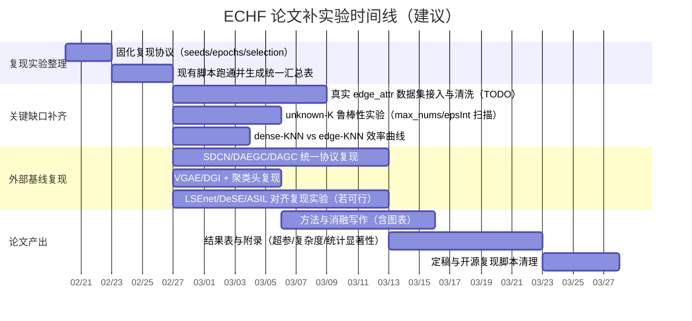

# Edge Enhanced Unsupervised Graph Neural Network Clustering 的深度研究与论文式 README 重构草案

## 执行摘要

该项目围绕“无监督/自监督图聚类”构建了一条明确的工程—研究主线：在 **LSEnet / DSI（可微结构信息/结构熵）** 的框架上，引入 **ECHF（Edge-Calibrated Hierarchical Fusion）** 家族作为当前主线，重点解决“边信息（尤其是异质图/带属性边）在聚类中的可用性与稳定注入”问题，并通过一套分支对照脚本与阶段性汇总报告组织实验复现。仓库的 README 将 **B15_ECHF_main（分支主线）** 与 **g15_echf_main（默认可运行 preset）** 作为当前主推配置，强调三点增量：**V12 校准残差融合（assignment-score 级别）**、**Path‑B 层级边属性传播**、以及 **图级自适应门控 graph_alpha**（用于抑制异质图上“过强边注入”的风险）。这些设计在仓库内部报告中被解释为“在保持结构熵优化内核不变的同时，让 edge features 可用且不易失控”。（仓库 README 与 `exp/` 报告提供了该叙述与数值汇总；见后文链接）

从学术定位看，本项目最接近 **“结构信息/结构熵驱动的深度图聚类”** 这一新兴分支：其上游有 **LSEnet（ICML 2024）**，提出可微结构信息 DSI 并在 Lorentz 双曲空间中学习分割树；紧随其后有 **DeSE（KDD 2025）** 强调“深度结构熵”与结构学习层；而用户指定的 **arXiv:2504.09970** 当前版本标题为 **ASIL（Augmented Structural Information Learning）**，并显示“最后修订于 2026‑02‑02，IEEE TPAMI 接收”。citeturn7view0turn14view0turn14view1  
因此，本项目可以被理解为：在“结构熵/分割树范式”上，进一步把 **边的权重/属性/置信** 纳入 assignment 和分层传播路径，形成一条更接近真实异质网络（仓库称 urban graphs）的工程化研究支线。

但若以“论文可发表”为标准，当前仍存在显著缺口：  
关键缺口集中在 **（a）对真实 edge attributes 的系统验证不足**（因为许多常用基准并无边属性，仓库更多通过“从节点特征/度构造 generic edge features”来训练 V6/V7/V8/V12）；**（b）缺少与更广泛强基线（特别是近年的图聚类/对比学习聚类/结构学习聚类）在统一协议下的对照**；**（c）对 cluster-number 机制（未知 K vs 上界 K，空簇/小簇修复）缺少单独消融与理论讨论**；**（d）复杂度与可扩展性只在代码层面做了 edge‑KNN 近似，但缺少系统的效率实验与误差分析**。这些都需要通过“缺失实验清单 + 复现实验计划”补齐（后文给出可执行的补实验矩阵、默认超参建议与时间评估）。

## 仓库结构与实现细节概览

仓库以“可运行的实验平台”组织，核心入口与研究材料在根目录 + `modules/` + `tools/` + `configs/` + `exp/` 五部分完成闭环：

- **运行入口**：`main.py`（argparse 参数齐全，支持 edge 变体、gamma schedule、Path‑A/Path‑B 开关、known-only eval、BF16 AMP 等）。
- **训练编排**：`exp.py`（训练循环、早停、gamma 线性 schedule、以 *min train loss* 选模型、并可计算结构指标 modularity / conductance 等）。
- **数据与边构造**：`data.py`（PyG 内置数据集自动下载；自定义 `*_adj.npy/*_feat.npy/*_label.npy`；并实现多种 edge 预加权与 edge_attr 标准化/拼接、Path‑A 权重融合等）。
- **模型与损失**：`modules/dsi.py`（DSI/结构熵损失实现 + KNN augmentation；并在大图时提供 edge‑KNN 模式避免 O(N²)）；`modules/model.py`（LSENet 分层结构与 Path‑B 边属性上卷积/粗化）；`modules/layers.py`（LorentzAssignment：V5/V6/V7/V8/V12 的 edge‑fusion 发生在 assignment-score）。
- **实验工具链**：`tools/run_preset.py`（preset 驱动；根据数据集自动填 max_nums/epochs/hid_dim 等）；`tools/run_benchmark_branch_compare.py` 与 `tools/run_urban_branch_compare.py`（统一对照实验与汇总 CSV）。
- **实验中心**：`exp/`（版本命名、阶段结果快照、主线报告；README 指向 `MAINLINE_ECHF_B15_G15_2026-02-19.md` 等）。

依赖清单在 `requirements.txt`，包含 PyTorch、PyG、geoopt（Lorentz 流形）、以及评估所需 sklearn/networkx/munkres 等。

为便于审阅关键实现点，以下给出 **按提交 f31de462（2026‑02‑19）固定的文件锚点链接**（行号范围为“宽范围覆盖”，用于快速跳转与全文检索；如需精确定位可在页面内搜索函数名）：

```text
README（主线说明与证据快照）
https://github.com/ReedGAOOO/edge-enhanced-unsupervised-graph-neural-network-clustering/blob/f31de46273cdd0c7809779d01d4369a32c390a74/README.md#L1-L220

训练入口与参数（edge_variant / Path-A / Path-B / gamma schedule）
https://github.com/ReedGAOOO/edge-enhanced-unsupervised-graph-neural-network-clustering/blob/f31de46273cdd0c7809779d01d4369a32c390a74/main.py#L1-L220

训练循环（min train loss 选模型；结构指标 modularity/conductance；trial 稳定性）
https://github.com/ReedGAOOO/edge-enhanced-unsupervised-graph-neural-network-clustering/blob/f31de46273cdd0c7809779d01d4369a32c390a74/exp.py#L1-L420

数据加载与边构造（V1-V12 的 edge_weight 形成；edge_attr 标准化；Path-A 权重融合）
https://github.com/ReedGAOOO/edge-enhanced-unsupervised-graph-neural-network-clustering/blob/f31de46273cdd0c7809779d01d4369a32c390a74/data.py#L1-L320

DSI/结构熵损失（KNN augmentation；大图 edge-KNN 模式；SI loss 计算）
https://github.com/ReedGAOOO/edge-enhanced-unsupervised-graph-neural-network-clustering/blob/f31de46273cdd0c7809779d01d4369a32c390a74/modules/dsi.py#L1-L260

核心创新之一：LorentzAssignment 的边融合（V5/V6/V7/V8/V12）
https://github.com/ReedGAOOO/edge-enhanced-unsupervised-graph-neural-network-clustering/blob/f31de46273cdd0c7809779d01d4369a32c390a74/modules/layers.py#L1-L360

核心创新之二：LSENet 分层与 Path-B 层级 edge_attr 粗化传播
https://github.com/ReedGAOOO/edge-enhanced-unsupervised-graph-neural-network-clustering/blob/f31de46273cdd0c7809779d01d4369a32c390a74/modules/model.py#L1-L340

默认主线 preset（g15_echf_main）
https://github.com/ReedGAOOO/edge-enhanced-unsupervised-graph-neural-network-clustering/blob/f31de46273cdd0c7809779d01d4369a32c390a74/configs/presets/g15_echf_main.json#L1-L120

preset 运行器（数据集到默认超参映射；别名兼容）
https://github.com/ReedGAOOO/edge-enhanced-unsupervised-graph-neural-network-clustering/blob/f31de46273cdd0c7809779d01d4369a32c390a74/tools/run_preset.py#L1-L260
```

## 研究问题与方法定位

### 问题陈述

给定一个图 \(G=(V,E)\)，节点特征矩阵 \(X\in \mathbb{R}^{|V|\times F}\)，以及（可选的）边权/边属性，本项目目标是学习节点的聚类划分 \(y^{pred}\)（或更一般地：学习一棵层级划分树），在 **不使用真实标签监督** 的前提下，使划分与图的结构与语义一致，并在下游用 NMI/ARI/ACC 等指标对齐评估（标签仅用于评估，而非训练）。

在学术谱系上，本项目显式沿用 LSEnet/DSI 的核心动机：经典深度图聚类往往依赖 **预设聚类数 \(K\)** 或“先嵌入再 k-means”的两阶段流程；而结构信息/结构熵视角试图把“划分树/社区结构”直接作为可优化对象，从而弱化对固定 \(K\) 的依赖。LSEnet 的摘要明确提出：构建可微结构信息 DSI，最小化 DSI 可得到“最优分割树”，并在 Lorentz 双曲空间里实现神经网络化的树学习，从而支持“未知聚类数”的聚类目标。citeturn14view0turn13search1

本仓库进一步把“边的信息”前移到聚类决策路径中，试图解决两类现实痛点：  
其一，许多真实网络（仓库称 urban/hetero graphs）边的异质性较强，若直接把结构信号以固定强度注入，容易造成错误聚合；其二，若图存在边属性（关系类型、强度、时间、空间交互等），仅用邻接矩阵会浪费信息，但“盲目使用边属性”也容易引入噪声与偏差。因此仓库主线采用 **“校准（calibrated）+ 门控（adaptive）+ 层级传播（hierarchical）”** 的组合策略。

### 目标与关键假设（明确标注未给出的细节）

已在代码与 README 中明确/可推断的假设：

- **训练阶段不使用标签**：训练目标来自 `modules/dsi.py` 的 `se_loss`（结构熵/结构信息形式）。  
- **聚类数机制为“上界/层级容量”**：`main.py` 将 `max_nums` 作为一个列表输入（示例 `[50,10]`），决定LSENet层级各层的“最大父节点数”；最终评估时通过 `fix_cluster_results` 处理“过小簇”（小于 `epsInt`）把其节点重分配到“大簇父节点”上，从而允许出现空簇或减少有效簇数（但这不等同于严谨的“自动选择 K”）。  
- **边属性可缺省**：若数据集无 `edge_attr`，代码会构造 generic edge features（由节点特征相似度、度/度差等组成），并标准化用于 V6/V7/V8/V12（这意味着“edge-enhanced”在许多基准上依赖“派生边特征”而非真实边属性）。

仓库未明确给出的关键实验设定（需在论文写作中标注为 *未声明*，并给出默认建议）：

- 数据集的官方/通行 split、是否移除自环、多图训练还是单图训练：**未声明**（从实现看多数是单图全量训练）。  
- 是否进行特征归一化、adj 对称化等细节：**部分隐含在代码中，但未在 README 以可复现表格给出**。  
- 城市（urban）数据集的来源、规模、edge_attr 的真实语义：**未在公共 README 给出**（但工具脚本内列出了数据集名列表）。

## 模型与算法剖析

### 数据管线与边信息构造

本项目把“边的处理”分成三层：

第一层：**预加权（pre-weighting）**——在 `data.py` 中针对不同 `edge_variant` 形成用于消息传递/结构熵计算的稀疏邻接（至少两份：`adj_msg` 与 `adj_si`）。其核心思想是：在原始边上构造结构权重（度相关）、特征相似权重（余弦与温度 `edge_feat_temp`）、以及二者的混合（`edge_hybrid_alpha`），并可通过 `edge_input_prior_alpha` 混入数据集自带权重（若存在）。这一阶段对应 README 中的 V1–V4/V5“hybrid pre-weight”。（实现细节见 `data.py` 与 `main.py` 参数说明链接）

第二层：**边属性编码（edge_attr）**——若数据集提供 `edge_attr`，可选择 `append_generic_edge_attr` 把 generic edge features 追加到给定 edge_attr；若未提供，则直接构造 generic edge features。之后标准化，并与稀疏边索引对齐、去重 coalesce。该 `edge_attr` 主要用于 V6/V7/V8/V12 的 assignment-score 融合与 Path‑B 的层级传播。

第三层：**Path‑A vs Path‑B**——二者可同时启用但主线默认强调 Path‑B：  
- **Path‑A（edge_attr_weight_blend）**：把 edge_attr 映射成标量权重并混入结构熵图（默认 `apply_to=si_only`），直觉是“让结构熵看到边属性”。但 README 明确指出主线默认 `edge_attr_weight_blend=0`，认为把富边特征压缩为单标量会损失语义。  
- **Path‑B（edge_attr_hierarchical）**：把 edge_attr 随着层级聚合向上“粗化传播”，使更高层的聚合仍能感知边语义。这与“层级社区/树结构”更相容，因此成为 ECHF 主线。

### DSI/结构熵损失与训练图构造

训练损失在 `modules/dsi.py::se_loss`，核心由两部分组成：

一是 **KNN augmentation**：  
- 在小图或 `knn_mode=dense` 时，计算叶子嵌入 \(z\) 的两两相似（通过 Lorentz 内积/距离的变形），对每个节点取 top‑K 形成稀疏 `adj_aug`，并经过 softmax 得到概率图。  
- 在大图或 `knn_mode=edge/auto` 时，为避免 O(N²)，只在“已有边 + 自环”集合上打分，并对每个源节点做 top‑K 截断再 scatter_softmax，形成近似的 `adj_aug`。这是一种“候选边集合受限”的 KNN 增强策略，牺牲了全图近邻搜索的完整性以换取可扩展性。

二是 **结构熵图组合与 SI loss**：  
`adj_train = adj_base + alpha * adj_aug`（同时对 message 图与 SI 图各自组合），并把该训练图送入编码器得到层级 assignment 矩阵。随后通过反复 `assᵀ A ass` 得到各层邻接，再按层累加结构熵项，最终得到归一化的负结构熵损失。该范式与 LSEnet/DSI 的摘要描述一致：通过神经 assignment 构建分割树并以结构信息为目标。citeturn14view0turn13search1

### ECHF 的核心：assignment-score 级别的边校准融合

仓库 README 把主线概括为 “calibrated edge fusion + hierarchical edge propagation”，其中最关键的“edge fusion”发生在 `modules/layers.py::LorentzAssignment.forward`。其计算流程可概括为：

- 基础 attention-score：对每条边 \((u,v)\) 计算 \(score_{uv} = -d(q_u,k_v)\)，再对同一源节点的外连边做 softmax 得到注意力权重，并用其聚合 assignment logits。  
- 在此基础上叠加不同的边融合项（V5/V6/V7/V8/V12），改变 softmax 前的 logits，从而直接影响聚类树的 parent assignment。

ECHF 主线强调的 **V12** 可以视为“V5 的稳定结构项 + 边属性残差校准项”：

- **V5（结构项 trunk）**：将结构边权 \(w_{uv}\) 的对数 `log(w)` 作为先验信号注入，同时通过 `reliability`（基于权重分布的 sigmoid 标准化 + 可选分位数阈值）抑制低置信边；并可引入 **graph_alpha**（图级门控）控制全局注入强度，以适配异质图。  
- **V6/V7（边属性门控）**：使用一个小型 MLP 编码 edge_attr，输出 bias 与 gate，通过 gate 作为“边属性可靠性”，并把 bias（标准化后）作为注入信号。V7 增加与结构 log 的“对齐残差”项。  
- **V8（结构—属性校准混合）**：同时计算结构可靠性与属性可靠性，并用二者 agreement（标准化的 edge_log 与 attr_bias 的相关）来生成 mix_beta，实现结构项与属性项的可调混合。  
- **V12（主线）**：保留 V5 的结构 trunk，并把属性残差作为在 trunk 上的“校准补偿”，使模型在边属性噪声大时仍可退化为较稳健的结构注入，在边属性可信且与结构一致时再提升属性权重。

这一设计与“结构信息驱动 + 边属性增强 + 校准防过拟合”的研究直觉一致，也与用户指定的结构信息路线（LSEnet、DeSE、以及 2504.09970/ASIL）在问题动机上高度相容：这些工作共同强调“结构信息/结构熵在深图聚类里是关键但难以可微/难以融入属性”，并持续在可微化、复杂度与属性融合上推进。citeturn14view0turn14view1turn7view0

### Path‑B：层级 edge_attr 传播的意义

在树/层级聚类中，边属性的“语义”往往不仅作用于叶子层：当若干节点被合并为超点（cluster），原始边属性需要被汇聚到超边（cluster‑to‑cluster）的层级上，才能让更高层决策继续感知关系语义。`modules/model.py` 中实现了 edge_attr 的“hard coarsen”策略：在每次 pooling（assignment）后，根据 cluster‑to‑cluster 的 adjacency 权重，对落在同一对 cluster 的叶边属性进行加权汇总，从而形成下一层的 edge_attr，并继续用于更高层的 LorentzAssignment（当启用 `edge_attr_hierarchical`）。这与 ASIL/LSEnet 类型方法“学习分割树并逐层上卷积”的结构天然匹配：树的每一层都可被视为一个新的图，需要可继承的关系描述。citeturn14view0turn7view0

### 训练与评估协议

训练循环在 `exp.py`，最重要的两点是：

- **模型选择规则**：主默认以 *min train loss* 选择 checkpoint；对照脚本（如 benchmark compare）甚至把 `eval_freq=epochs` 以避免“用标签评估做中途挑 epoch”导致的隐性监督。此点对于无监督聚类论文非常关键，应在论文协议中显式写出并作为可复现性承诺。  
- **评估指标扩展**：除 NMI/ARI/ACC（标签对齐）外，还计算 modularity 与 conductance（结构质量）以及 trial 稳定性（多次 cluster trial 的 pairwise NMI）。这与 ASIL 摘要中强调的“conductance 上界/改进”叙述更容易形成呼应与理论对照。citeturn7view0

### 与至少六类相关方法的对照表

下表以“监督类型、边使用方式、典型数据集、指标”对齐本项目研究定位。注意：不同论文/代码对“是否用边属性”定义不一；这里按“是否显式建模 edge attributes / edge weights 并进入目标函数或消息传递”解释。

| 方法 | 年份 | 监督类型 | 边使用方式 | 主要创新点 | 常用数据集（示例） | 常报告指标 |
|---|---:|---|---|---|---|---|
| VGAE（Variational Graph Auto-Encoders）citeturn11view2 | 2016 | 无监督表示学习（常再接聚类） | 使用邻接矩阵重构；通常不含边属性 | 变分图自编码器，用重构学习节点表示 | Cora/Citeseer/Pubmed 等citeturn11view2 | AUC/AP（链路），有时 NMI/ARI/ACC（聚类） |
| DGI（Deep Graph Infomax）citeturn12view0 | 2018 | 无监督表示学习（常再接聚类） | 使用邻接做 GCN 编码；不建模边属性 | 最大化局部—全局互信息的节点表征学习citeturn12view0 | 引文网络、社交网络等citeturn12view0 | 下游分类/有时聚类 NMI/ARI |
| DAEGC（Attributed Graph Clustering: A Deep Attentional Embedding Approach）citeturn15search11 | 2019 | 端到端图聚类（无监督 + self-training） | 利用邻接/属性； attention 作用于邻居 | 目标导向聚类：图注意自编码 + 自训练聚类联合优化citeturn15search11 | 属性图：Cora/Citeseer/Pubmed 等 | NMI/ARI/ACC |
| SDCN（Structural Deep Clustering Network）citeturn11view0 | 2020 | 深聚类（无监督 + 双自监督） | 通常由特征构 KNN 图；不含真实边属性 | AE 与 GCN 通过 delivery operator 融合，并用双自监督机制优化citeturn11view0 | 多模态/多领域数据（含图） | NMI/ARI/ACC |
| DAGC（Deep Attention-guided Graph Clustering with Dual Self-supervision）citeturn16view0 | 2021/2023 | 深图聚类（无监督 + 双自监督） | 使用结构图；强调多尺度融合 | 异质融合+尺度融合+分布融合；软/硬双自监督（含 KL 变体）citeturn16view0 | 图基准数据集 | NMI/ARI/ACC |
| LSEnet（Lorentz Structural Entropy Neural Network）citeturn14view0turn13search1 | 2024 | 深图聚类（结构信息驱动） | 主要用结构（邻接）+ 节点属性；不强调边属性 | 提出可微结构信息 DSI 与 Lorentz 双曲空间分割树学习，实现“未知 K”导向citeturn14view0 | Cora/Citeseer/Pubmed/Amazon 等（论文常见）citeturn13search1 | NMI/ARI/ACC（聚类） |
| DeSE（Unsupervised Graph Clustering with Deep Structural Entropy）citeturn14view1 | 2025 | 无监督图聚类（结构熵 + 结构学习） | 强调结构学习层生成/增强图；边多作为结构对象 | 用软 assignment 计算结构熵；结构学习层缓解稀疏/噪声；ASS 层联合优化citeturn14view1 | 多个图基准citeturn14view1 | NMI/ARI/ACC |
| ASIL（arXiv:2504.09970，TPAMI 接收，v2 最后修订 2026‑02‑02）citeturn7view0 | 2026 | 无监督深图聚类（结构信息 + 增强/对比） | 用结构信息/结构熵并讨论树对比的效率界 | 提出可微结构信息框架与增广结构信息学习，并声称在线性复杂度下改进 conductance 等citeturn7view0 | 多基准（摘要提 Citeseer 等）citeturn7view0 | NMI 等（摘要给出提升）citeturn7view0 |

对照中可以看到：ECHF 的“创新位置”与传统 DAEGC/SDCN/DAGC 不同——它不以“自训练/伪标签/KL 目标分布”作为核心，而是继承 LSEnet/DSI/ASIL 的结构信息路线，把主要创新投入到 **边信号如何进入‘树’的学习**（尤其是 assignment-score）以及 **边属性如何沿层级传播**。

### 建议的模型流程图（Mermaid）

```mermaid
flowchart TD
  A[输入: 节点特征 X, 邻接 A, 可选 edge_attr] --> B[边预加权/构造: V1-V4<br/>得到 adj_msg / adj_si]
  B --> C[叶子嵌入: LorentzConv + LorentzBoost]
  C --> D[KNN 增强: adj_aug<br/>dense 或 edge-KNN 模式]
  D --> E[训练图: adj_train = adj_base + alpha * adj_aug]
  E --> F[LSENet 分层: 多层 LorentzAssignment + pooling]
  F --> G{edge_variant}
  G -->|V5| H1[结构 trunk: log(w) + reliability<br/>可选 graph_alpha]
  G -->|V6/V7| H2[边属性门控: attr_encoder -> gate/bias]
  G -->|V8| H3[结构-属性校准混合: mix_beta]
  G -->|V12| H4[trunk + 校准残差]
  H1 --> I[得到各层 assignment 矩阵 C^h]
  H2 --> I
  H3 --> I
  H4 --> I
  I --> J[层级邻接: ass^T A ass]
  J --> K[结构熵/结构信息损失: SI loss]
  K --> L[AdamW 更新]
  B -. Path-A .-> PA[edge_attr_weight_blend<br/>把 edge_attr 映射为 SI 权重]
  F -. Path-B .-> PB[edge_attr_hierarchical<br/>edge_attr 随层级粗化传播]
```

## 研究空白与待完成实验

本节以“可发表论文”的标准列出最关键的缺口，并给出必须补齐的实验与默认设定。凡仓库未声明的细节，均标注为“未指定”，并给出可复现默认值。

### 关键研究空白

**边属性有效性缺口**  
当前主线 V12/Path‑B 的叙述对“边属性有助于异质图聚类”非常关键，但公共基准（Cora/Citeseer/Pubmed/Amazon 等）往往没有真实 edge_attr，代码更多使用 generic edge features 替代。这会让论文评审质疑：提升来自“更复杂的边权工程”还是来自“真实关系语义”？必须用至少一个“真实边属性/边类型”数据集补强。

**边属性有效性问题（已回答，2026-02-20）**  
对“初始几个公共数据集是否带 edge_attr”的审计结论如下：
- 在原始 PyG 对象中，`cora/citeseer/pubmed/computers/photo` 均 **无** `edge_attr`。证据：`results/edge_attr_audit_v1/README.md`，明细：`results/edge_attr_audit_v1/edge_attr_presence.csv`。  
- 当前仓库训练时会在无 `edge_attr` 情况下自动构造 7 维 generic edge features（余弦相似、L1/L2 差、度相关统计等），并作为 `data.edge_attr` 使用。实现：`data.py:45`, `data.py:211`, `data.py:212`, `data.py:254`。  
- 结论：经典基准上“edge-enhanced”的改进应解释为“**派生边先验 + 融合机制**”而非“真实关系语义边属性”。论文中需把 claim 收敛为该表述，并额外补一个真实边属性/边类型数据集实验来闭环。

**未知 K 的论证缺口**  
LSEnet/ASIL/DeSE 路线的关键卖点之一是“无需预设 K 或弱化对 K 的依赖”。然而本仓库仍需 `max_nums` 作为层级容量，并在评估中对小簇做修复（epsInt）。这在实践上合理，但需要用实验说明：  
- `max_nums` 作为上界是否鲁棒？  
- “空簇/小簇修复”是否造成指标偏差？  
- 是否存在更一致的“自适应截断/自动停止层级”策略？

**未知 K 问题（已回答，2026-02-20）**  
已完成一轮针对 `max_nums/epsInt` 的系统消融：`results/benchmark_unknownk_ablation_v2_compact`（120/120 成功，见 `decision.json`）。

- 原版 DSE 是否也有这些参数：**是**。参考实现同样包含 `max_nums` 与 `epsInt`，并调用 `fix_cluster_results`。证据：  
`reference/DSE_clustering-main/main.py:35`, `reference/DSE_clustering-main/main.py:43`, `reference/DSE_clustering-main/modules/dsi.py:49`。  
- `max_nums` 上界鲁棒性：**不鲁棒，且高度敏感**。  
在 `k in {6,10,16}` 扫描中，`k16-k6` 的总体退化明显（例如 baseline ΔNMI=-0.1254，g15 ΔNMI=-0.1338）。证据：`results/benchmark_unknownk_ablation_v2_compact/analysis_summary.md`，`results/benchmark_unknownk_ablation_v2_compact/k16_minus_k6_overall.csv`。  
- 是否“自动发现 K”：当前证据显示 **没有**。  
`pred_n_clusters_mean` 与 `max_nums` 完全相等（逐数据集逐条件均为 True），说明当前更接近“容量上界=输出簇数”。证据：`results/benchmark_unknownk_ablation_v2_compact/max_sweep_predk_equals_max_check.csv`。  
- `epsInt` 修复是否引入指标偏差：**有影响但总体较小**。  
相对 no-fix（`epsInt=-1`）的总体变化在小量级（baseline: ΔNMI≈+0.0012@eps=8；g15: ΔNMI≈+0.0040@eps=8），且 `delta_pred_k_vs_nofix` 为 0。证据：`results/benchmark_unknownk_ablation_v2_compact/eps_sweep_delta_overall.csv`。  
- 能否取消或自适应：当前代码路径下 **不能直接取消 `max_nums`**（层级 assignment 维度由其定义），可做的是把 no-fix (`epsInt=-1`) 作为评估对照，或引入“自适应截断”策略（尚未实现）。

**自适应截断代理实验（已回答）**  
- 用更小上界 `k=6` 作为“保守容量代理”相对默认 k（每数据集默认值）整体提升明显（baseline ΔNMI=+0.0616，g15 ΔNMI=+0.0672）。证据：`results/benchmark_unknownk_ablation_v2_compact/k6_minus_default_overall.csv`。  
- 这证明“上界容量可调”有效，但本质仍是手动超参，不是自动停止/自动选 K。

**对比基线不足与协议统一问题**  
仓库内部对比主要围绕自家 V 变体与少量条件（例如 G15 vs G17）展开。论文需要引入更广泛基线，至少覆盖：  
- 结构熵路线：LSEnet、DeSE、ASIL（若能复现实验最好）。citeturn14view0turn14view1turn7view0  
- 深图聚类路线：SDCN、DAEGC、DAGC 等。citeturn11view0turn15search11turn16view0  
- 表示学习+聚类路线：VGAE、DGI + 聚类头。citeturn11view2turn12view0  

**效率—精度权衡缺口**  
代码提供 edge‑KNN 模式以支持大图，但尚缺“效率曲线/误差曲线”：当从 dense‑KNN 切换到 edge‑KNN 时，性能与时间如何变化？这类实验在系统论文中几乎必需。

**效率—精度权衡补实验（已完成第一轮，2026-02-20）**  
为补齐该缺口，已新增并执行统一脚本 `tools/run_knn_mode_tradeoff.py`，输出 runtime/accuracy 曲线与 dense 参照误差：

- **经典基准全量（5 数据集 × 2 seeds × k={4,8,16} × mode={dense,edge,auto}）**  
  - 命令与结果：`results/benchmark_knn_mode_tradeoff_v1/README.md`  
  - 规模：90/90 成功。  
  - 曲线：  
    - `results/benchmark_knn_mode_tradeoff_v1/figures/fig1_efficiency_runtime_vs_k.png`  
    - `results/benchmark_knn_mode_tradeoff_v1/figures/fig2_error_delta_nmi_vs_k.png`  
    - `results/benchmark_knn_mode_tradeoff_v1/figures/fig3_tradeoff_speedup_vs_delta_nmi.png`  
  - 关键结论（相对 dense）：  
    - `edge`：平均 **更慢**（speedup≈0.70x），但 NMI 有正增益（k=4/8/16 分别约 +0.0035/+0.0093/+0.0195）。  
    - `auto`：速度接近 dense（0.96x~0.99x），精度差异接近 0（ΔNMI 约 -0.0005~+0.0014）。  

- **城市规模梯度（boston/washingtondc/singapore/melbourne，k=8）**  
  - 命令与结果：`results/benchmark_knn_mode_tradeoff_urban_scale_v1/README.md`  
  - 规模：12/12 成功。  
  - 曲线：  
    - `results/benchmark_knn_mode_tradeoff_urban_scale_v1/figures/fig1_efficiency_runtime_vs_k.png`  
    - `results/benchmark_knn_mode_tradeoff_urban_scale_v1/figures/fig2_error_delta_nmi_vs_k.png`  
    - `results/benchmark_knn_mode_tradeoff_urban_scale_v1/figures/fig3_tradeoff_speedup_vs_delta_nmi.png`  
  - 关键结论：在这些中等规模城市图上，`auto` 与 `dense` 的精度几乎一致，运行时间略优（平均 speedup≈1.03x）；`edge` 精度近似持平但平均偏慢（≈0.92x）。  

- **大图压力（boston/tokyo/beijing，k=8）**  
  - 命令与结果：`results/benchmark_knn_mode_tradeoff_urbanstress_v1/README.md`  
  - 规模：7/9 成功。  
  - 关键结论：`dense` 在 `tokyo` 与 `beijing` 直接 OOM（见 `results/benchmark_knn_mode_tradeoff_urbanstress_v1_urban_tokyo_plot_s0_dense_k8/runner.log` 与 `results/benchmark_knn_mode_tradeoff_urbanstress_v1_urban_beijing_plot_s0_dense_k8/runner.log`），而 `edge/auto` 可完成，说明 edge‑KNN 的核心价值在于**可扩展性与可运行性边界**，不只是小图提速。

> 结论性建议：论文中应将 efficiency‑accuracy 结论拆成两层报告：  
> (1) 小/中图：dense 往往更快，edge 主要贡献在精度或结构指标；  
> (2) 大图：dense 进入 OOM 区间，edge/auto 提供可训练路径（这是系统价值主轴）。

### 必须补齐的实验清单（含默认值与预估算力）

下表给出一组“最低可发表”补实验矩阵。时间为经验估计（以单张 24GB GPU、PyTorch 2.1+、图全量训练为参考；实际需以你们的硬件与图规模校准）。

| 实验模块 | 数据集建议 | 指标 | 必要基线 | 关键超参（默认） | 必要消融 | 预估算力/时间 |
|---|---|---|---|---|---|---|
| 真实边属性验证 | 选择至少 1 个带 edge features/edge types 的图聚类设置（未指定；可用异质网络/知识图谱子图/交互网络） | NMI/ARI/ACC + modularity/conductance | 主线 G15_ECHF_main；V5；Path‑A only；Path‑B only | epochs=100（或 60/180 依规模）；hid_dim=64/256；knn=8；alpha=0.01 | edge_attr 置零/打乱；只用 generic vs 只用真实 edge_attr；edge_attr_hierarchical 开关 | 视规模：中等图（<50k边）每 run 5–20 分钟 |
| 未知 K 鲁棒性 | 现有经典集（Cora/Citeseer/Pubmed/Amazon） + 1 个异质图（Chameleon/Squirrel/Actor 等，需外部预处理） | 同上 + pred_n_clusters | LSEnet/DeSE（若可复现），或至少与 SDCN/DAEGC 比 | max_nums 扫描：如 [100,20],[50,10],[30,6]；epsInt 扫描：{2,5,8,12} | “不做 fix_cluster_results” vs 做；epsInt 对性能/结构指标影响 | 小图每配置 3 seeds × 180 epochs：总计数小时级 |
| ECHF 组件消融 | 经典图 + urban 图（仓库已有） | label 指标 + 结构指标 + 稳定性 | G15_ECHF_main 与 G17_V5_temp15 | edge_fusion_gamma schedule：start=0.2,end=1.2,sched_epochs=100 | 去掉 graph_alpha；去掉 mix_beta；V12→V5；Path‑B off | 每数据集 3 seeds：可与现有脚本复用 |
| Path‑A vs Path‑B 系统对照 | 同上 | 同上 | Path‑A only、Path‑B only、A+B | edge_attr_weight_blend ∈ {0,0.3,0.5,0.7}；apply_to ∈ {si_only,both} | edge_attr_weight_temp 扫描 {0.5,1.0,1.5} | 小图每点 1–3 分钟；点数多需做 DOE |
| 效率曲线 | 至少 1–2 个大图（>20k nodes） | wall‑clock、显存、NMI/ARI（若有标签） | dense‑KNN vs edge‑KNN | knn_mode ∈ {dense,edge,auto}；knn_auto_threshold 扫描 | k ∈ {4,8,16}；alpha ∈ {0.005,0.01,0.02} | 每 run 10–60 分钟；需记录资源 |
| 统一基线复现 | 经典图（最少 3 个） | NMI/ARI/ACC | SDCN、DAEGC、DAGC、VGAE、DGI | 统一 seeds=0/1/2；统一 early stop=off（patience=0）；统一 eval=final epoch | 同一指标计算实现（避免实现差异） | 取决于基线实现；至少 1–2 周工程量 |

> 默认复现协议建议：  
> seeds = {0,1,2}；每个设置跑 3 次；模型选择按仓库做法 *min train loss* 或在公平对比时固定“最后 epoch”；禁用早停（`patience=0`）以避免不同方法早停策略不一致导致的偏置；报告 mean±std。对比脚本中显式写出 `eval_freq=epochs` 的动机（避免“用标签挑 epoch”）。这一点与无监督论文写作一致性非常重要。

## 论文式 README 草案与实验路线图

下面给出一个“可直接替换 README.md、并可扩展为论文初稿”的结构化草案。为满足可复现性与审稿习惯，草案强调：贡献点可验证、假设透明、缺失实验明确列为 TODO。

### 标题

**ECHF：面向无监督图聚类的边校准层级融合网络——在结构熵分割树框架上的 edge‑enhanced 扩展**

### 摘要

我们研究无监督图聚类，目标是在不依赖人工标签监督的情况下发现图中的社区/簇结构。现有深图聚类方法常依赖预设聚类数 \(K\) 或两阶段“嵌入+聚类”流程；结构信息/结构熵路线通过学习层级分割树，提供了无需固定 \(K\) 的新范式。基于此，我们提出 ECHF（Edge‑Calibrated Hierarchical Fusion），在结构熵分割树网络之上引入边增强机制，使边权与边属性能够以“校准、门控、层级传播”的方式进入 parent assignment，从而在异质图上避免过强边注入导致的错误聚合。我们实现了 V5/V6/V8/V12 等一系列 edge‑fusion 变体，并提出主线 V12：以结构项为稳定 trunk，叠加与结构—属性一致性相关的校准残差；同时提出 Path‑B，把 edge_attr 沿层级 coarsen 传播至高层图。我们在多组基准上报告 NMI/ARI/ACC 与 modularity/conductance，并给出 cross‑trial 稳定性分析。结果表明：在城市异质图（known‑only）设置上，ECHF 相较结构项基线得到更一致的结构质量改善；在经典图基准上，ECHF 在鲁棒性排名上取得优势。我们进一步列出尚需补齐的真实边属性验证、unknown‑K 鲁棒性与效率曲线实验，以推动该方向形成可复现、可解释的 edge‑enhanced 结构熵聚类研究。

> 结构熵路线关键参考：LSEnet（ICML 2024）citeturn14view0turn13search1，DeSE（KDD 2025）citeturn14view1，ASIL（arXiv:2504.09970，v2 2026‑02‑02，TPAMI 接收）citeturn7view0。

### 引言

- 研究动机：真实图的边往往异质、噪声与稀疏并存；“仅用邻接”浪费关系语义，“盲目用边属性”又易过拟合。  
- 结构熵分割树范式的优势：把聚类结构作为可优化对象，与 conductance 等结构目标相关联，且可在不固定 \(K\) 的情况下学习层级划分。citeturn14view0turn7view0  
- 本文贡献：  
  1) 在 parent assignment 的 softmax logits 级别引入校准边融合（V12）；  
  2) 提出 graph_alpha 图级门控与 reliability 边级置信约束，缓解异质图过强注入；  
  3) 提出 Path‑B 层级 edge_attr 传播，使边语义跨层保持；  
  4) 给出可复现的对照脚本、阶段性汇总与结构指标评估；  
  5) 明确列出缺失实验与未来工作（真实 edge_attr、unknown‑K、效率曲线）。

### 相关工作

- 深图聚类（自训练/AE+GCN 融合）：DAEGCciteturn15search11、SDCNciteturn11view0、DAGCciteturn16view0。  
- 表示学习与聚类组合：VGAEciteturn11view2、DGIciteturn12view0 等。  
- 结构信息/结构熵路线：LSEnetciteturn14view0turn13search1、DeSEciteturn14view1、ASILciteturn7view0。  
- 边增强图建模的一般趋势：在更广义的图学习中，显式 edge channels/edge disentanglement 是近年持续方向（例如 Graph Transformer with edge channels 的思路）。citeturn12view3

### 方法

- **输入与图构造**：说明 `adj_msg/adj_si`、edge_variant 的预加权、edge_attr 的来源（真实 vs generic）、Path‑A/Path‑B 的区别。  
- **叶嵌入与 KNN augmentation**：说明 dense‑KNN 与 edge‑KNN 近似模式，给出复杂度差异，并声明默认 `knn=8, alpha=0.01`（若未指定）。  
- **LorentzAssignment 与 ECHF 融合**：形式化写出  
  \[
  score_{uv} = -d(q_u,k_v) + \gamma \cdot graph\_alpha \cdot \Psi(w_{uv}, edge\_attr_{uv})
  \]
  并分别解释 V5（结构 trunk）、V6/V7（属性门控）、V8（校准混合）、V12（trunk+残差）。  
- **层级 edge_attr 传播（Path‑B）**：说明从叶层到父层的超边属性聚合/加权方式。  
- **目标函数**：给出层级结构熵（SI loss）的计算形式，并解释为何以 *min train loss* 做模型选择能够避免标签泄漏（或规定对照时固定最后 epoch）。

### 实验

- **数据集**：  
  - 经典 PyG 基准：Cora/Citeseer/Pubmed/Amazon（Computers/Photo）等（仓库自动下载）。  
  - 城市异质图（urban\_*）：需在论文补充来源与预处理（当前未指定）。  
  - **必须新增**：至少 1 个“真实 edge_attr/edge type”数据集（TODO）。  
- **评估**：NMI/ARI/ACC（标签对齐）、modularity/conductance（结构）、trial‑stability（pairwise NMI），并注明 known‑only 评估策略（将未知标签映射为 -1）。  
- **基线**：V5 vs V12；Path‑A only vs Path‑B only；并补充外部基线（SDCN/DAEGC/DAGC/VGAE/DGI/LSEnet/DeSE/ASIL，尽可能统一协议）。  
- **实现细节**（默认建议，若未指定）：  
  - optimizer=AdamW(lr=1e‑3, wd=1e‑2)；  
  - epochs：经典集 180；urban 60；  
  - hid_dim：经典集 256；urban 64；  
  - early stop：对照实验关闭（patience=0）。  
- **消融**：graph_alpha、mix_beta、edge_confidence_quantile、edge_attr_hierarchical、edge_attr_weight_blend 等。

### 结果与讨论

- 报告 mean±std；同时报告结构指标是否与 label 指标一致改善（尤其在异质图上）。  
- 讨论何时 V12 会退化为 V5（当结构—属性 agreement 低、mix_beta 小）；何时属性残差起主要作用。  
- 讨论 edge‑KNN 近似模式的潜在偏差，并用效率曲线佐证。

### 结论

总结 ECHF 在结构熵分割树范式上引入边校准层级融合的价值，并强调未来必须补齐的真实边属性、unknown‑K 与效率实证。

### 推荐引用列表（优先一次文献）

- LSEnet（ICML 2024 / arXiv:2405.11801）citeturn13search1turn14view0  
- DeSE（KDD 2025 / arXiv:2505.14040）citeturn14view1  
- ASIL（arXiv:2504.09970，v2: 2026‑02‑02，TPAMI 接收）citeturn7view0  
- SDCN（arXiv:2002.01633，WWW 2020）citeturn11view0  
- DAEGC（IJCAI 2019）citeturn15search11  
- DAGC（arXiv:2111.05548，TCSVT 接收）citeturn16view0  
- DGI（arXiv:1809.10341，ICLR 2019）citeturn12view0  
- VGAE（arXiv:1611.07308）citeturn11view2  

### 优先级检查清单

高优先级（决定论文能否立得住）  
- 真实 edge_attr 数据集验证（至少 1 个）  
- unknown‑K/`max_nums`/`epsInt` 鲁棒性与机制解释  
- 외部强基线统一协议复现（至少覆盖 SDCN、DAEGC、DAGC、VGAE、DGI、LSEnet、DeSE；ASIL 若实现可用则加分）citeturn11view0turn15search11turn16view0turn11view2turn12view0turn14view0turn14view1turn7view0  
- dense‑KNN vs edge‑KNN 的效率—精度曲线

中优先级（增强说服力与可解释性）  
- Path‑A vs Path‑B 系统对照（含 edge_attr 打乱/置零控制实验）  
- graph_alpha 与 mix_beta 的可视化统计（跨数据集分布）  
- 结构指标与 label 指标一致性分析（相关性、反例）

低优先级（锦上添花）  
- 在更多异质图/噪声图上做鲁棒性 stress test  
- 进一步的理论补充（例如为何 V12 校准项应当与 conductance/结构熵目标一致）

### 实验时间线（Mermaid）


